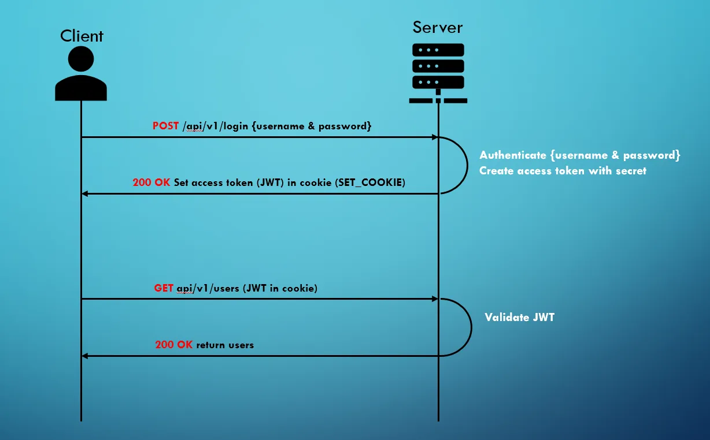

# [Cookie-based JWT Authentication with Spring Security](https://medium.com/spring-boot/cookie-based-jwt-authentication-with-spring-security-756f70664673)

Tutorial tomado de la página del
autor [Zeeshan Adil](https://medium.com/spring-boot/cookie-based-jwt-authentication-with-spring-security-756f70664673)

Veamos cómo implementar la autenticación basada en cookies en spring security utilizando jwt:



## Dependencias

````xml
<!--Spring Boot 3.2.0-->
<!--Java 21-->
<dependencies>
    <dependency>
        <groupId>org.springframework.boot</groupId>
        <artifactId>spring-boot-starter-data-jpa</artifactId>
    </dependency>
    <dependency>
        <groupId>org.springframework.boot</groupId>
        <artifactId>spring-boot-starter-security</artifactId>
    </dependency>
    <dependency>
        <groupId>org.springframework.boot</groupId>
        <artifactId>spring-boot-starter-web</artifactId>
    </dependency>

    <dependency>
        <groupId>com.mysql</groupId>
        <artifactId>mysql-connector-j</artifactId>
        <scope>runtime</scope>
    </dependency>
    <dependency>
        <groupId>org.projectlombok</groupId>
        <artifactId>lombok</artifactId>
        <optional>true</optional>
    </dependency>
    <dependency>
        <groupId>io.jsonwebtoken</groupId>
        <artifactId>jjwt-api</artifactId>
        <version>0.11.5</version>
    </dependency>
    <dependency>
        <groupId>io.jsonwebtoken</groupId>
        <artifactId>jjwt-impl</artifactId>
        <version>0.11.5</version>
    </dependency>
    <dependency>
        <groupId>io.jsonwebtoken</groupId>
        <artifactId>jjwt-jackson</artifactId>
        <version>0.11.5</version>
    </dependency>
    <dependency>
        <groupId>org.springframework.boot</groupId>
        <artifactId>spring-boot-starter-test</artifactId>
        <scope>test</scope>
    </dependency>
    <dependency>
        <groupId>org.springframework.security</groupId>
        <artifactId>spring-security-test</artifactId>
        <scope>test</scope>
    </dependency>
</dependencies>
````

### Cookies

El servidor puede transmitir el token JWT al navegador a través de una cookie, y al solicitar la interfaz del lado
del servidor, `el navegador incluye automáticamente el token JWT en la cabecera de la cookie`. La autenticación se
consigue entonces verificando el token JWT en la cabecera de la cookie por el servidor. Sin embargo, este enfoque es
susceptible de ataques CSRF.

Para mitigar esta vulnerabilidad, una solución consiste en configurar la `propiedad SameSite de la cookie a Strict`.
Esto significa que la cookie sólo se transmitirá si la URL de la página actual coincide con el destino de la solicitud.

Aunque las cookies solucionan los problemas de CSRF, siguen estando expuestas a ataques XSS. Los actores maliciosos
pueden extraer información de las cookies utilizando scripts JavaScript. Para reforzar la seguridad, la propiedad de la
cookie puede establecerse como `HttpOnly`, lo que impide el acceso no autorizado a través de secuencias de comandos del
lado del cliente.